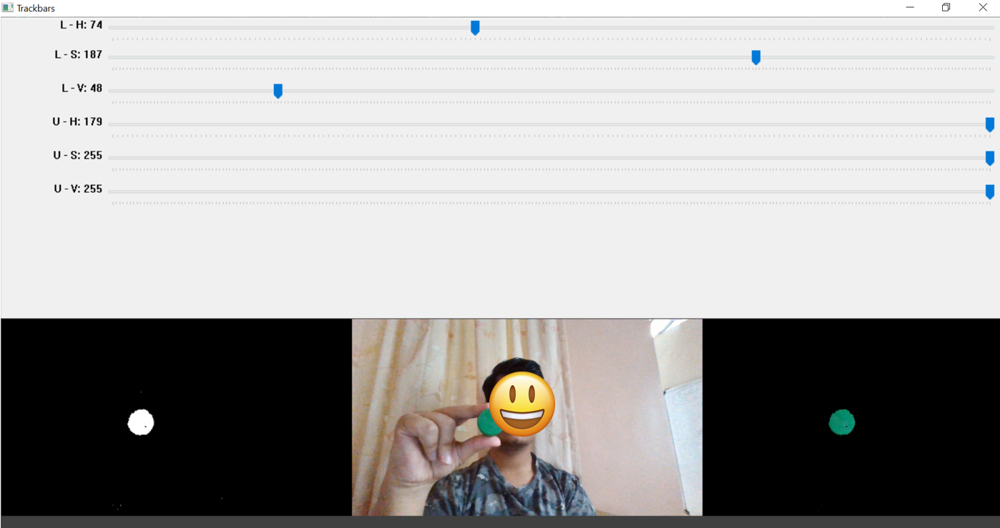
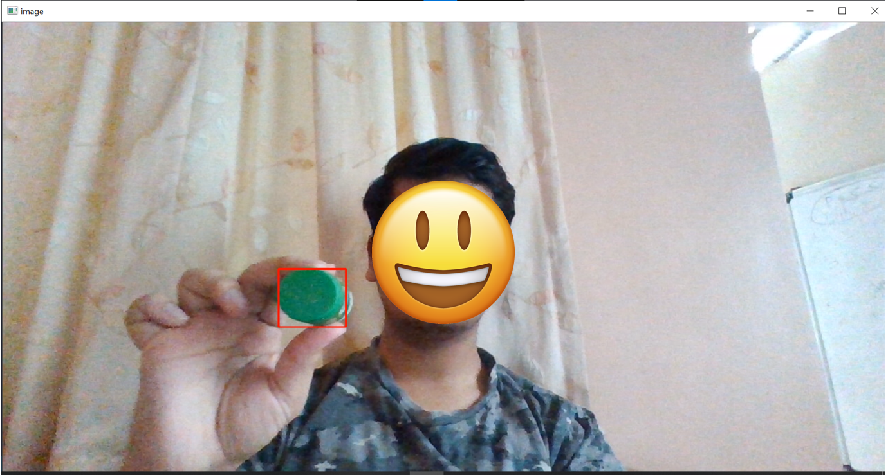
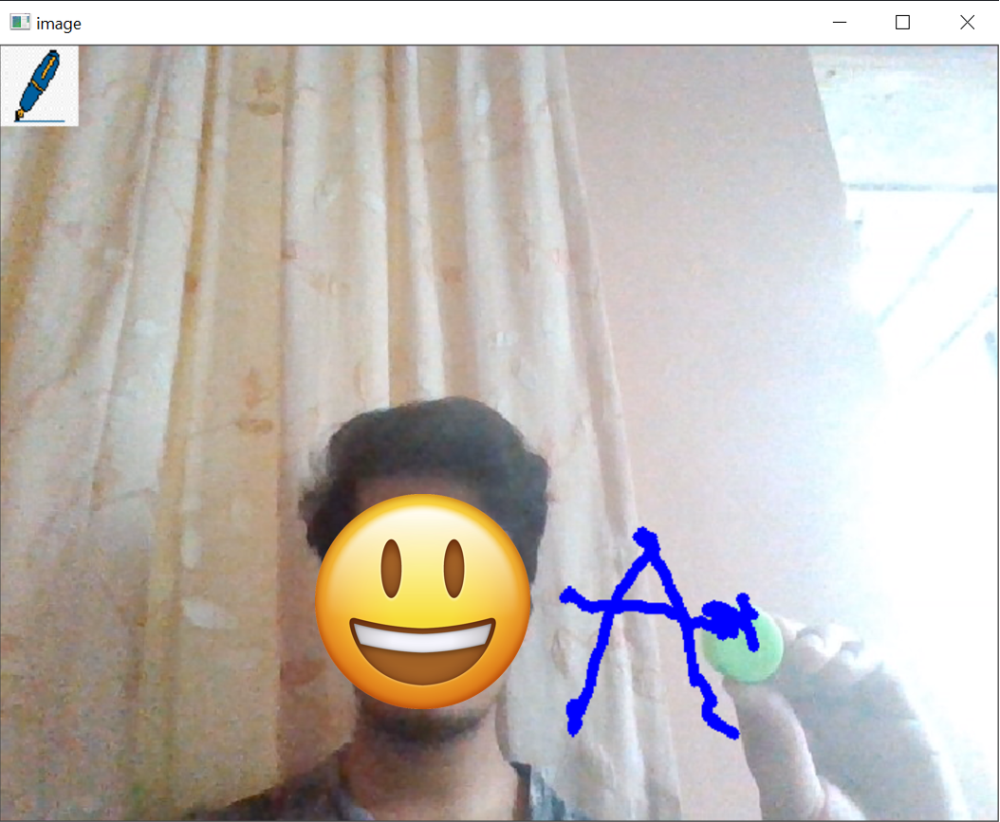
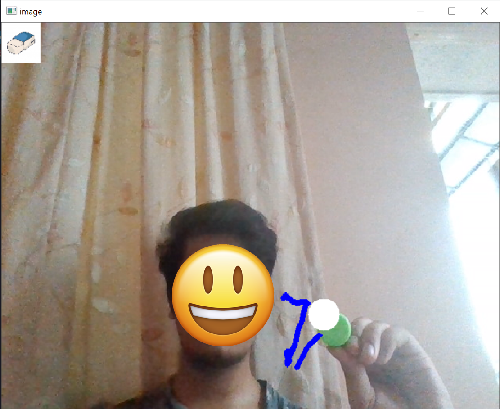

# Freehand-Writing

## Guide

### 1. Filtering the Object to Track

Open the `Filter.py` file.  
Use the sliders to adjust the HSV (Hue, Saturation, Value) values so that everything except the object you want to track is masked.

> 💡 **Tip:** Use a green-colored object—it's the easiest to filter accurately.

Once your object is properly filtered (as shown in the bottom right preview), press the **`S` key** to save the HSV values.

---

### 2. Tracking the Object

With the saved HSV values, the object can now be easily tracked.

---

### 3. Writing with the Object

Open the `Writing.py` file.  
As you bring the filtered object into the camera's view, you can start writing immediately.

- To **erase**, hover your hand over the **pen symbol** to activate the eraser.
- Once done erasing, hover your **other hand over the eraser** to switch back into writing mode.

---

Make sure to tune the parameters and lighting for best results.
